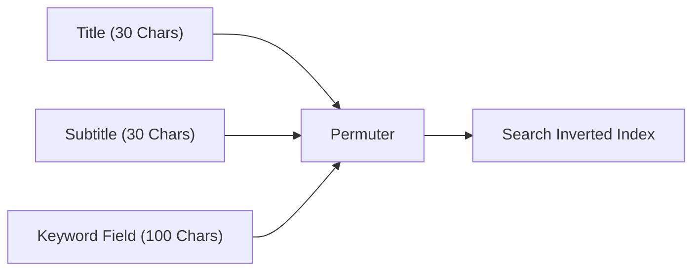

# How the App Store Tokenizes Hyphens, Spaces, and Commas

Apple's App Store search engine relies on an inverted index tokenizer that parses app metadata into discrete indexing tokens. While title and subtitle fields undergo natural language stemming, the 100-character keyword field is processed through strict delimiter rules.

When developers submit keywords, characters such as spaces, hyphens, slashes, and periods alter how Apple's lexer creates search combinations. A single misplaced space or incorrect delimiter can silently invalidate high-volume search terms without triggering a metadata validation warning in App Store Connect.

## Hyphens: Splitting vs. Compounding Behavior

Hyphenated words (`habit-tracker`, `cross-platform`, `e-commerce`) exhibit specific indexing behaviors depending on the storefront language locale:

1. **Delimiter Splitting**: In English locales (US, UK, CA, AU), the tokenizer treats a hyphen as both an individual space delimiter and a compound joiner. Submitting `habit-tracker` automatically indexes for `habit`, `tracker`, and `habit tracker`.
2. **Character Count Waste**: Placing `habit-tracker` in the 100-character field consumes 13 characters. If written as `habit,tracker`, it consumes only 13 characters but cleanly prevents parser ambiguity.
3. **Non-Latin Locales**: In Japanese (JP) and Korean (KR) storefronts, hyphens are frequently treated as literal characters, failing to split into constituent kanji or hangul tokens.

```text
Delimitation Matrix:
Input String: "habit-tracker,budget-app"
Parsed Tokens: ["habit", "tracker", "habit tracker", "budget", "app", "budget app"]
Wasted Characters: 2 hyphen bytes that could store another keyword token.
```

## Commas vs. Spaces: Delimiter Cost Analysis

A persistent myth among mobile marketers is that spaces between commas are required for legibility. In Apple's keyword field, spaces after commas (`fitness, tracker, health`) consume valuable character real estate.

| Format | Raw String Consumed | Usable Tokens Extracted | Character Efficiency |
| :--- | :--- | :--- | :--- |
| Space & Comma | `fitness, tracker, run, health` | 4 tokens | 71% (8 wasted chars) |
| Comma Only | `fitness,tracker,run,health` | 4 tokens | 100% (0 wasted chars) |
| Spaces Only | `fitness tracker run health` | 1 single compound | Wasted permutation |

Because the App Store algorithm automatically permutes comma-separated tokens across the title, subtitle, and keyword field, adding spaces between commas directly robs you of 8 to 12 characters per locale.

## Permutation Logic Across Metadata Layers

The App Store combines tokens across all three primary metadata tiers:



If the word `budget` sits in your Title and `tracker` sits in your Keyword Field, Apple's search index evaluates your app for the search query `budget tracker`. There is zero algorithmic benefit to duplicating `tracker` in both fields.

## Key Operational Rules for 100-Character Field Optimization

To maximize your keyword footprint on iOS:

- **Never use spaces after commas**: Write `run,bike,pace`, never `run, bike, pace`.
- **Avoid repeating singulars and plurals**: In English, indexing `card` automatically indexes `cards`.
- **Eliminate Stop Words**: Prepositions (`for`, `with`, `and`, `the`) are automatically filtered out by Apple's lexer.
- **Leverage Feature Workflows**: Use [Keyword Research & Discovery Engine](/features/keyword-research) to audit live tokenization and cross-reference with our [App Store Keyword Research Guide](/blog/app-store-keyword-research).
